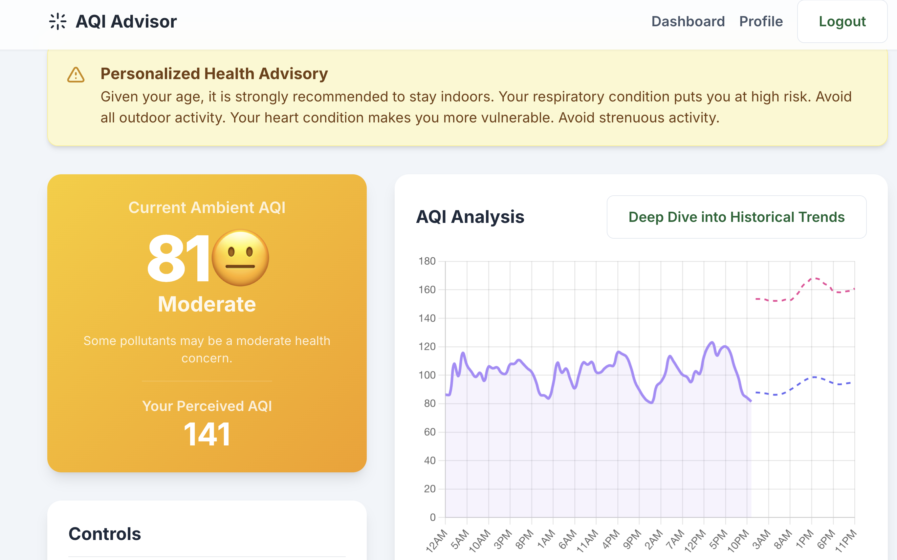

# Air Quality Intelligence: Estimation and Prediction of Urban Pollution



## 📖 Overview

**Air Quality Intelligence** is a full-stack web application developed as a 6th-semester software engineering project. It provides real-time Air Quality Index (AQI) estimations, future forecasts, and personalized health advisories for Kathmandu, Nepal. The application leverages a suite of machine learning models to transform raw environmental data into actionable insights, helping users mitigate the health risks associated with urban air pollution.

The primary motivation was to apply software engineering principles and machine learning techniques to address a significant real-world environmental challenge, demonstrating an end-to-end development process from data collection to deployment.

---

## 🚀 Key Features

* **Live AQI Estimation:** An Extra Trees Regressor model predicts the current AQI based on live weather and pollutant data from Open-Meteo and government sources.
* **Personalized Risk Assessment:** A second model adjusts the AQI based on a user's age and health profile, providing a "Perceived AQI" that reflects their specific risk.
* **LSTM-Powered Forecasting:** A Keras-based Long Short-Term Memory (LSTM) network forecasts AQI values for the next 72 hours.
* **Interactive Dashboard:** Visualizes historical and forecasted AQI data using Chart.js for intuitive trend analysis.
* **In-Depth Historical Analysis:** An Exploratory Data Analysis (EDA) modal provides deep dives into historical data, showing trends by month, day of the week, and hour.
* **User Authentication:** Secure user registration and login system for managing personal health profiles and receiving tailored advice.

---

## 🛠️ Tech Stack

* **Backend:** Python 3.9, Flask
* **Machine Learning:** TensorFlow (Keras), Scikit-learn, Pandas, NumPy
* **Frontend:** HTML, Tailwind CSS, Vanilla JavaScript
* **Data Visualization:** Chart.js
* **Database:** MySQL
* **Planned Deployment:** Docker, Gunicorn

---

## ⚙️ Getting Started

Follow these instructions to get a copy of the project up and running on your local machine.

### Prerequisites

* Python 3.9
* pip (Python package installer)
* A running MySQL server instance

### Installation

1.  **Clone the Repository**
    ```sh
    git clone [https://github.com/manishw7/air-quality-intelligence.git](https://github.com/manishw7/air-quality-intelligence.git)
    cd air-quality-intelligence
    ```

2.  **Create and Activate a Virtual Environment**
    ```sh
    # For Windows
    python -m venv venv
    .\venv\Scripts\activate

    # For macOS/Linux
    python3 -m venv venv
    source venv/bin/activate
    ```

3.  **Install Dependencies**
    ```sh
    pip install -r requirements.txt
    ```

4.  **Set Up Environment Variables**
    Create a `.env` file in the root directory. This is the most secure way to manage credentials.
    ```
    # Flask session key
    SECRET_KEY='your_super_secret_and_random_key'

    # Database credentials
    DB_HOST='localhost'
    DB_USER='your_db_user'
    DB_PASSWORD='your_db_password'
    ```
    The application will use these variables. The database name is hardcoded as `aqi_app`.

5.  **Set Up the Database**
    * Ensure your MySQL server is running and create the database:
        ```sql
        CREATE DATABASE aqi_app;
        ```
    * Run the provided database script to create the necessary tables from your `schema.sql` file.
        ```sh
        python database.py
        ```

6.  **Run the Application**
    ```sh
    python app.py
    ```
    The application will be available at `http://127.0.0.1:5001`.

---

## 🤖 Models Used

1.  **Main AQI Estimator (`model.pkl`):** An **Extra Trees Regressor** that predicts the ambient AQI value based on meteorological and pollutant features.
2.  **Personal Risk Model (`personal_risk_model.pkl`):** Another **Extra Trees Regressor** that takes the ambient AQI and user profile (age, health) as input to predict a personalized, perceived AQI.
3.  **Soil Data Imputer (`soil_imputer.pkl`):** A **MultiOutput Regressor** with a Random Forest base model, used to predict and fill in missing soil temperature and moisture data.
4.  **LSTM Forecast Model (`lstm_model.keras`):** A Keras sequential model with **two LSTM layers** and one Dense output layer, designed to analyze time-series data and forecast future AQI values.

---

## 🔮 Future Work

* **Containerization:** Package the application using **Docker** for simplified deployment and scalability.
* **Email/SMS Alerts:** Implement a notification system to alert users of hazardous AQI conditions based on their profile.
* **Expand Coverage:** Generalize the data pipeline to allow for AQI prediction in other cities.

---

## ✍️ Author

* **Manish Wagle** - [manishw7](https://github.com/manishw7)

---

## 📄 License

This project is licensed under the **MIT License**.